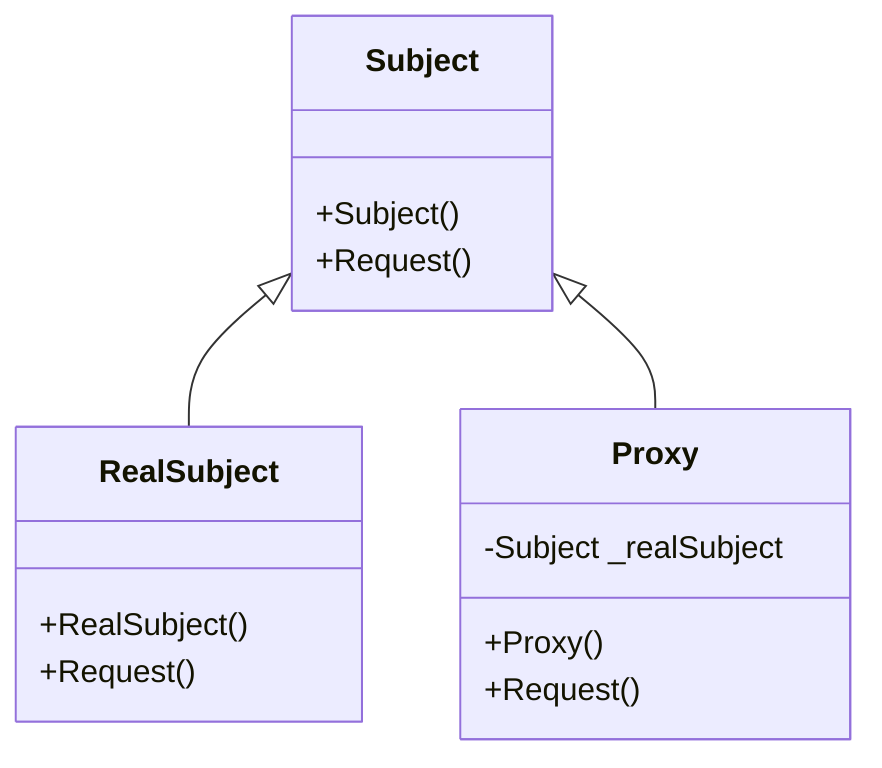

# Design Pattern - Proxy

+ 為其他物件提供一種代理，藉由這種方式控制對該物件的存取。
+ 依功能區分
  + remote proxy (遠端代理)
  + virtual proxy (虛擬代理)
  + protection proxy (設限代理)
  + smart reference (智慧參考)



+ Subject
  + 成為真正被代理物件的介面。
  + 成為 Proxy (代理者) 的介面。
  + 可能是個 interface 或是 abstract class。
+ RealSubject
  + Subject 的具體實作，定義 Proxy 所要代理的真正物件。
+ Proxy
  + 依照 Subject 介面所設計。
  + 內部會具有指向 Subject 或 RealSubject 的欄位。
  + 控制對於 RealSubject 的存取行為。

- Subject
	- 成為真正被代理物件的介面。
	- 成為 Proxy (代理者) 的介面。
	- 可能是個 interface 或是 abstract class。
- RealSubject
	- Subject 的具體實作，定義 Proxy 所要代理的真正物件。
- Proxy
	- 依照 Subject 介面所設計。
	- 內部會具有指向 Subject 或 RealSubject 的欄位。
	- 控制對於 RealSubject 的存取行為。

<br/>Subject 類別
```csharp
public abstract class Subject
{
    public abstract void Request();
}

public class RealSubject : Subject
{
    public override void Request()
    {
        Console.WriteLine("RealSubject request");
    }
}
```

<br/>Proxy 類別
```csharp
public class Proxy : Subject
{
    private Subject _realSubject;

    public Proxy()
    {
        _realSubject = new RealSubject();
    }

    public override void Request()
    {
        BeforeAction();
        _realSubject.Request();
        AfterAction();
    }

    private void BeforeAction()
    {
        Console.WriteLine("Proxy before request");
    }

    private void AfterAction()
    {
        Console.WriteLine("Proxy after request");
    }
}
```

<br/>Client 端程式
```csharp
Subject o = new Proxy();
o.Request();
```

## 讀檔

FileProcess 類別
```csharp
/// <summary>
/// 既有的 FileProcess 類別，無法更動程式碼
/// </summary>
public class FileProcess
{
    public void Write(string path, byte[] data)
    {
        File.WriteAllBytes(path, data);
    }
    public byte[] Read(string path)
    {
        if (File.Exists(path))
        {
            return File.ReadAllBytes(path);
        }
        else
        {
            throw new FileNotFoundException();
        }
    }
}
```

```csharp
/// <summary>
///  Adapter 的公開介面，同時也是 Proxy 抽象類別要實作的介面
/// </summary>
public interface IFileProcess
{
    void Write(string path, byte[] data);
    byte[] Read(string path);
}

/// <summary>
/// Adapter 的實作，介接已存在的 Original.FileProcess
/// </summary>
public class FileProcessAdapter : IFileProcess
{
    private Original.FileProcess _fileProcess;
    public FileProcessAdapter()
    {
        _fileProcess = new Original.FileProcess();
    }
    public byte[] Read(string path)
    {
        return _fileProcess.Read(path);
    }
    public void Write(string path, byte[] data)
    {
        _fileProcess.Write(path, data);
    }
}
```

<br/>讀寫權限旗標
```csharp
[Flags]
public enum Authority
{
    Read = 1,
    Write = 2
}

public class User
{
    public string Name { get; set; }
    public Authority FileAuthority { get; set; }
}
```

<br/>FileProxy 類別
```csharp
public class FileProcessProxy : IFileProcess
{
    private IFileProcess _subject;
    private User _user;

    public FileProcessProxy (User user)
    {
        _user = user;
        _subject  = new FileProcessAdapter();
    }

    public byte[] Read(string path)
    {
        if (CanRead())
        {
            return _subject.Read(path);
        }
        else
        {
            throw new UnauthorizedAccessException("使用者沒有讀取權限");
        }
    }

    public void Write(string path, byte[] data)
    {
        if (CanWrite())
        {
            _subject.Write(path, data);
        }
        else
        {
            throw new UnauthorizedAccessException("使用者沒有寫入權限");
        }
    }

    private bool CanRead()
    {
        return ((_user.FileAuthority & Authority.Read) == Authority.Read);
    }

    private bool CanWrite()
    {
        return ((_user.FileAuthority & Authority.Write) == Authority.Write);
    }
}
```

<br/>Client 端程式
```csharp
string path = "1.txt";
string source = "ABCDE FGHI";

User user = new User();
user.FileAuthority = (Authority.Write | Authority.Read);
FileProcessProxy writeProxy = new FileProcessProxy(user);
writeProxy.Write(path, Encoding.UTF8.GetBytes(source));

FileProcessProxy readProxy = new FileProcessProxy(user);
var actual = Encoding.UTF8.GetString(readProxy.Read(path));
```

<br/>此例為靜態代理，已寫死要代理什麼物件
<br/>也可設計成動態代理，可動態代理物件，但被代理物件彼此要有繼承關係
<br/>Sample002，IFileProcess同時是 Adapter，Proxy，Decorator
<br/>Decorator 和 Proxy 很像，兩邊的東西都要有同樣的介面

<br/>Decorator VS Proxy
+ 都在解決繼承濫用的問題。
+ 裝飾器模式關注於在一個物件上動態的增加方法，而代理模式關注於控制對於被代理物件的存取。
+ 代理模式是對它的客戶隱藏一個物件的具體信息。
+ 裝飾器模式的目的不在於控制存取，而是擴展功能。