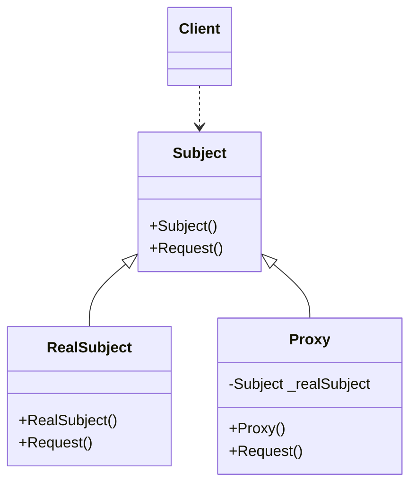

# Design Pattern - Proxy

+ 為其他物件提供一種代理，藉由這種方式控制對該物件的存取。
+ 依功能區分
  + remote proxy (遠端代理)
  + virtual proxy (虛擬代理)
  + protection proxy (設限代理)
  + smart reference (智慧參考)

## 類別圖


+ Subject
  + 成為真正被代理物件的介面。
  + 成為 Proxy (代理者) 的介面。
  + 可能是個 interface 或是 abstract class。
+ RealSubject
  + Subject 的具體實作，定義 Proxy 所要代理的真正物件。
+ Proxy
  + 依照 Subject 介面所設計。
  + 內部會具有指向 Subject 或 RealSubject 的欄位。
  + 控制對於 RealSubject 的存取行為。

<br/>Subject 類別
```csharp
public abstract class Subject
{
    public abstract void Request();
}
```

<br/>RealSubject 類別
```csharp
public class RealSubject : Subject
{
    public override void Request()
    {
        Console.WriteLine("RealSubject request");
    }
}
```

<br/>Proxy 類別
```csharp
public class Proxy : Subject
{
    private Subject _realSubject;

    public Proxy()
    {
        _realSubject = new RealSubject();
    }

    public override void Request()
    {
        BeforeAction();
        _realSubject.Request();
        AfterAction();
    }

    private void BeforeAction()
    {
        Console.WriteLine("Proxy before request");
    }

    private void AfterAction()
    {
        Console.WriteLine("Proxy after request");
    }
}
```

<br/>Client 端程式
```csharp
Subject sub = new Proxy();
sub.Request();
```

## Proxy 控制檔案存取
### 本來已經有一個讀寫檔案的功能，為它增加權限管理的功能。

<br/>既有的 FileProcess 類別，假設無法更動程式碼
```csharp
public class FileProcess
{
    public void AnotherWrite(string path, byte[] data)
    {
        File.WriteAllBytes(path, data);
    }

    public byte[] AnotherRead(string path)
    {
        if (File.Exists(path))
        {
            return File.ReadAllBytes(path);
        }
        else
        {
            throw new FileNotFoundException();
        }
    }
}
```

<br/>Adapter 的公開介面，同時也是 Proxy 抽象類別要實作的介面
```csharp
public interface IFileProcess
{
    void Write(string path, byte[] data);
    byte[] Read(string path);
}
```

<br/>Adapter 的實作，介接已存在的 FileProcess
```csharp
public class FileProcessAdapter : IFileProcess
{
    private FileProcess _fileProcess;

    public FileProcessAdapter()
    {
        _fileProcess = new FileProcess();
    }

    public byte[] Read(string path)
    {
        return _fileProcess.AnotherRead(path);
    }

    public void Write(string path, byte[] data)
    {
        _fileProcess.AnotherWrite(path, data);
    }
}
```

<br/>讀寫權限旗標
```csharp
[Flags]
public enum Authority
{
    Read = 1,
    Write = 2
}

public class User
{
    public string Name { get; set; }
    public Authority FileAuthority { get; set; }
}
```

<br/>FileProxy 類別
```csharp
public class FileProcessProxy : IFileProcess
{
    private IFileProcess _subject;
    private User _user;

    public FileProcessProxy (User user)
    {
        _user = user;
        _subject  = new FileProcessAdapter();
    }

    public byte[] Read(string path)
    {
        if (CanRead())
        {
            return _subject.Read(path);
        }
        else
        {
            throw new UnauthorizedAccessException("使用者沒有讀取權限");
        }
    }

    public void Write(string path, byte[] data)
    {
        if (CanWrite())
        {
            _subject.Write(path, data);
        }
        else
        {
            throw new UnauthorizedAccessException("使用者沒有寫入權限");
        }
    }

    private bool CanRead()
    {
        return ((_user.FileAuthority & Authority.Read) == Authority.Read);
    }

    private bool CanWrite()
    {
        return ((_user.FileAuthority & Authority.Write) == Authority.Write);
    }
}
```

<br/>Client 端程式
```csharp
string path = "1.txt";
string source = "ABCDE FGHI";

User user = new User();
user.FileAuthority = (Authority.Write | Authority.Read);
FileProcessProxy writeProxy = new FileProcessProxy(user);
writeProxy.Write(path, Encoding.UTF8.GetBytes(source));

FileProcessProxy readProxy = new FileProcessProxy(user);
var actual = Encoding.UTF8.GetString(readProxy.Read(path));
```

### 讓前面的 Decorator Sample 和 Proxy Sample 搭配使用。

Decorator 的抽象
```csharp
public abstract class FileDecorator : IFileProcess
{
    protected readonly IFileProcess _fileProcess;

    protected FileDecorator(IFileProcess fileProcess)
    {
        _fileProcess = fileProcess;
    }

    public abstract byte[] Read(string path);
    public abstract void Write(string path, byte[] data);
}
```

<br/>Base64 裝飾器
```csharp
public class Base64FileDecorator : FileDecorator
{
    public Base64FileDecorator(IFileProcess fileProcess) : base(fileProcess)
    { }

    public override byte[] Read(string path)
    {
        var base64Bytes = _fileProcess.Read(path);
        return Decode(base64Bytes);
    }

    private byte[] Decode(byte[] base64Bytes)
    {
        var bytes = Convert.FromBase64String(Encoding.UTF8.GetString(base64Bytes));
        return bytes;
    }

    public override void Write(string path, byte[] data)
    {
        var base64Bytes = Encode(data);
        _fileProcess.Write(path, base64Bytes);
    }

    private byte[] Encode(byte[] data)
    {
        return Encoding.UTF8.GetBytes(Convert.ToBase64String(data));
    }
}
```

<br/>Des 加密裝飾器
```csharp
public class DESCryptoFileDecorator : FileDecorator
{
    private byte[] key;
    private byte[] iv;
    private DESCryptoServiceProvider des;

    public DESCryptoFileDecorator(IFileProcess fileProcess) : base(fileProcess)
    {
        key = new byte[] { 0x01, 0xFF, 0x02, 0xAA, 0x55, 0xBB, 0x19, 0x20 };
        iv = new byte[] { 0x11, 0xF3, 0x43, 0x0A, 0x35, 0xE9, 0x82, 0x80 };
        des = new DESCryptoServiceProvider();
        des.Key = key;
        des.IV = iv;
    }

    public override byte[] Read(string path)
    {
        byte[] encryptBytes = _fileProcess.Read(path);
        return DecryptData(encryptBytes);
    }

    private byte[] DecryptData(byte[] encryptBytes)
    {
        byte[] outputBytes = null;
        using (MemoryStream memoryStream = new MemoryStream(encryptBytes))
        {
            using (CryptoStream decryptStream = new CryptoStream(memoryStream, des.CreateDecryptor(), CryptoStreamMode.Read))
            {
                MemoryStream outputStream = new MemoryStream();
                decryptStream.CopyTo(outputStream);
                outputBytes = outputStream.ToArray();
            }
        }
        return outputBytes;
    }

    public override void Write(string path, byte[] data)
    {
        byte[] outputBytes = EncryptData(data);
        _fileProcess.Write(path, outputBytes);
    }

    private byte[] EncryptData(byte[] data)
    {
        byte[] outputBytes = null;
        using (MemoryStream memoryStream = new MemoryStream())
        {
            using (CryptoStream encryptStream = new CryptoStream(memoryStream, des.CreateEncryptor(), CryptoStreamMode.Write))
            {
                MemoryStream inputStream = new MemoryStream(data);
                inputStream.CopyTo(encryptStream);
                encryptStream.FlushFinalBlock();
                outputBytes = memoryStream.ToArray();
            }
        }
        return outputBytes;
    }
}
```

<br/>Aes 加密裝飾器
```csharp
public class AESCryptoFileDecorator : FileDecorator
{
    private byte[] key;
    private byte[] iv;
    private AesCryptoServiceProvider aes;

    public AESCryptoFileDecorator(IFileProcess fileProcess) : base(fileProcess)
    {
        key = new byte[] { 0x01, 0xFF, 0x02, 0xAA, 0x55, 0xBB, 0x19, 0x20, 0x01, 0xFF, 0x02, 0xAA, 0x55, 0xBB, 0x19, 0x20 };
        iv = new byte[] { 0x11, 0xF3, 0x43, 0x0A, 0x35, 0xE9, 0x82, 0x80, 0x11, 0xF3, 0x43, 0x0A, 0x35, 0xE9, 0x82, 0x80 };
        aes = new AesCryptoServiceProvider();
        aes.Key = key;
        aes.IV = iv;
    }

    public override byte[] Read(string path)
    {
        byte[] encryptBytes = _fileProcess.Read(path);
        return DecryptData(encryptBytes);
    }

    private byte[] DecryptData(byte[] encryptBytes)
    {
        byte[] outputBytes = null;
        using (MemoryStream memoryStream = new MemoryStream(encryptBytes))
        {
            using (CryptoStream decryptStream = new CryptoStream(memoryStream, aes.CreateDecryptor(), CryptoStreamMode.Read))
            {
                MemoryStream outputStream = new MemoryStream();
                decryptStream.CopyTo(outputStream);
                outputBytes = outputStream.ToArray();
            }
        }
        return outputBytes;
    }

    public override void Write(string path, byte[] data)
    {
        byte[] outputBytes = EncryptData(data);
        _fileProcess.Write(path, outputBytes);
    }

    private byte[] EncryptData(byte[] data)
    {
        byte[] outputBytes = null;
        using (MemoryStream memoryStream = new MemoryStream())
        {
            using (CryptoStream encryptStream = new CryptoStream(memoryStream, aes.CreateEncryptor(), CryptoStreamMode.Write))
            {
                MemoryStream inputStream = new MemoryStream(data);
                inputStream.CopyTo(encryptStream);
                encryptStream.FlushFinalBlock();
                outputBytes = memoryStream.ToArray();
            }
        }
        return outputBytes;
    }
}
```

<br/>Gzip 壓縮裝飾器
```csharp
public class GZipFileDecorator : FileDecorator
{
    public GZipFileDecorator(IFileProcess fileProcess) : base(fileProcess)
    { }

    public override byte[] Read(string path)
    {
        byte[] compressedBytes = _fileProcess.Read(path);
        return Decompress(compressedBytes);
    }

    private byte[] Decompress(byte[] compressedBytes)
    {
        byte[] outputBytes = null;
        MemoryStream input = new MemoryStream(compressedBytes);
        outputBytes = Decompress(input).ToArray();
        return outputBytes;
    }

    private MemoryStream Decompress(Stream compressed)
    {
        var decompressed = new MemoryStream();
        using (var zip = new GZipStream(compressed, CompressionMode.Decompress, true))
        {
            zip.CopyTo(decompressed);
        }
        decompressed.Seek(0, SeekOrigin.Begin);
        return decompressed;
    }

    public override void Write(string path, byte[] data)
    {
        byte[] outputBytes = Compress(data);
        _fileProcess.Write(path, outputBytes);
    }

    private byte[] Compress(byte[] data)
    {
        byte[] outputBytes = null;
        MemoryStream input = new MemoryStream(data);
        outputBytes = Compress(input).ToArray();
        return outputBytes;
    }

    private MemoryStream Compress(Stream decompressed)
    {
        var compressed = new MemoryStream();
        using (var zip = new GZipStream(compressed, CompressionLevel.Fastest, true))
        {
            decompressed.CopyTo(zip);
        }
        compressed.Seek(0, SeekOrigin.Begin);
        return compressed;
    }
}
```

<br/>Client 端程式
<br/>寫入的方式：先做 DES 加密，再做壓縮，再做 base64 編碼，再檢查權限，最後寫入檔案
<br/>讀取的方式：先檢查模限，再讀取檔案，再做 base64 解碼，再做解壓縮，最後是 DES 解密
```csharp
private string path = "1.txt";
private string source = "ABCDEFD 這是一本書";

User user = new User();
user.FileAuthority = Authority.Write | Authority.Read;
FileDecorator fileDecorator = new DESCryptoFileDecorator(new GZipFileDecorator(new Base64FileDecorator(new FileProcessProxy(user))));

fileDecorator.Write(path, Encoding.UTF8.GetBytes(source));

var result = Encoding.UTF8.GetString(fileDecorator.Read(path));
Console.WriteLine(result);
```

<br/>此例為靜態代理，已寫死要代理什麼物件
<br/>也可設計成動態代理，可動態代理物件，但被代理物件彼此要有繼承關係
<br/>Sample002，IFileProcess同時是 Adapter，Proxy，Decorator
<br/>Decorator 和 Proxy 很像，兩邊的東西都要有同樣的介面

<br/>Decorator VS Proxy
+ 都在解決繼承濫用的問題。
+ 裝飾器模式關注於在一個物件上動態的增加方法，而代理模式關注於控制對於被代理物件的存取。
+ 代理模式是對它的客戶隱藏一個物件的具體信息。
+ 裝飾器模式的目的不在於控制存取，而是擴展功能。

## todo RealProxy 的條件 範例