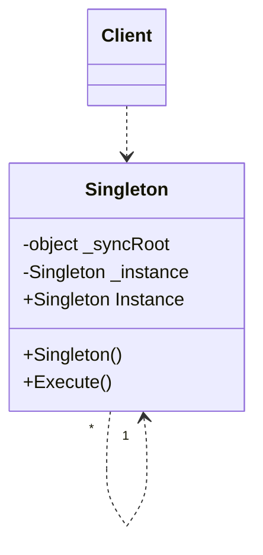

# Design Pattern - Singleton

- [Design Pattern - Singleton](#design-pattern---singleton)
  - [- Registry of Singletons](#--registry-of-singletons)
  - [概觀](#概觀)
  - [+ Double-locking](#-double-locking)
  - [類別圖](#類別圖)
    - [pseudo code](#pseudo-code)
  - [Registry of Singletons](#registry-of-singletons)
---
## 概觀
+ 確保類別只有一個物件實體存在，並且提供單一存取窗口。
+ 讓類別自己負責管理這唯一的物件實體。
+ Double-locking
---
## 類別圖


+ Singleton
  + 以具體密封類別(sealed class)的形式存在，建構式的存取層級為private
  + 定義一個Instance 的操作(在 C# 多半以 property 方式)，讓外界只能透過這個操作存取唯一的執行個體。
+ Client
  + 使用這個Singleton 功能者
  + Client 端透過Singleton 的Instance 屬性來操作此 Singleton。

<br/>

### pseudo code
Singleton 類別
```csharp
public sealed class SingletonClass
{
    private int i = 0;
    private static SingletonClass _singletonObject;
    private static object _syncRoot = new object();
    
    /// <summary>
    /// private constructor
    /// </summary>
    private SingletonClass()
    { }

    public void Show()
    {
        Console.WriteLine("Hello " + i.ToString());
        i += 1;
    }

    public static SingletonClass SingletonObject
    {
        get
        {
            if (_singletonObject == null)
            {
                lock (_syncRoot)
                {
                    if (_singletonObject == null)
                    {
                        GetSingleton();
                    }
                }
            }
            return _singletonObject;
        }
    }

    private static void GetSingleton()
    {
        _singletonObject = new SingletonClass();
    }
}
```

<br/>Client 端程式
```csharp
for (int i = 0; i < 10; i++)
{
    SingletonClass.SingletonObject.Show();
}
```
---
## Registry of Singletons
+ 又稱為 Multiton pattern
+ 管理一群不同型別的物件，而且希望在使用這些物件的時候都是以單例的形式。
+ 透過註冊表的方式達成。

<br/>SingletonRegistry 類別
```csharp
public class SingletonRegistry
{
    private static Dictionary<string, object> registry = new Dictionary<string, object>();
    
    public static T GetInstance<T>() where T : class, new()
    {
        Type type = typeof(T);
        string key = type.Name;
        if (!registry.ContainsKey(key))
        {
            registry[key] = new T();
        }
        return (T)registry[key];
    }
}
```

<br/>Client 端程式
```csharp
var o1 = SingletonRegistry.GetInstance<Class1>();
var o2 = SingletonRegistry.GetInstance<Class1>();

Console.WriteLine(object.ReferenceEquals(o1, o2));
```