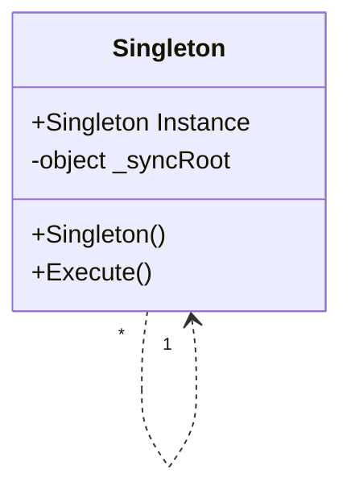

# Design Pattern - Singleton

+ 確保類別只有一個物件實體存在，並且提供單一存取窗口。
+ 讓類別自己負責管理這唯一的物件實體。
+ Double-locking



+ Singleton
  + 以具體密封類別(sealed class)的形式存在，建構式的存取層級為private
  + 定義一個Instance 的操作(在 C# 多半以 property 方式)，讓外界只能透過這個操作存取唯一的執行個體。
+ Client
  + 使用這個Singleton 功能者
  + Client 端透過Singleton 的Instance 屬性來操作此 Singleton。

<br/>Singleton
```csharp
public sealed class SingletonClass
{
    private int i = 0;
    private static SingletonClass _singletonObject;
    private static object _syncRoot = new object();
    
    /// <summary>
    /// private constructor
    /// </summary>
    private SingletonClass()
    { }

    public void Show()
    {
        Console.WriteLine("Hello " + i.ToString());
        i += 1;
    }

    public static SingletonClass SingletonObject
    {
        get
        {
            if (_singletonObject == null)
            {
                lock (_syncRoot)
                {
                    if (_singletonObject == null)
                    {
                        GetSingleton();
                    }
                }
            }
            return _singletonObject;
        }
    }

    private static void GetSingleton()
    {
        _singletonObject = new SingletonClass();
    }
}
```

<br/>Client 端程式
```csharp
for (int i = 0; i < 10; i++)
{
    SingletonClass.SingletonObject.Show();
}
```

## todo registry