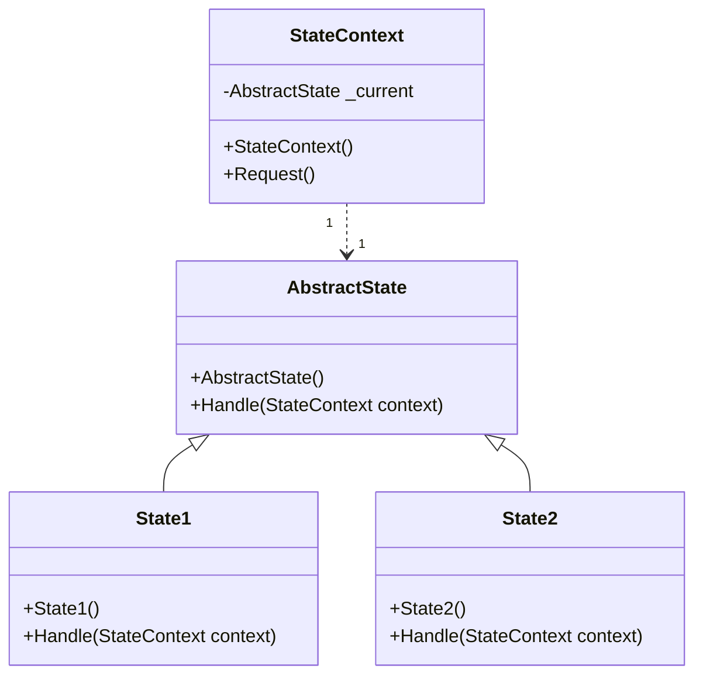

# Design Pattern - State

```mermaid
classDiagram
class StateContext {
    -AbstractState _current
    +StateContext()
    +Request()
}

class AbstractState {
    +AbstractState()
    +Handle(StateContext context)
}

class State1 {
    +State1()
    +Handle(StateContext context)
}

class State2 {
    +State2()
    +Handle(StateContext context)
}

StateContext "1" ..> "1" AbstractState
AbstractState <|-- State1
AbstractState <|-- State2
```