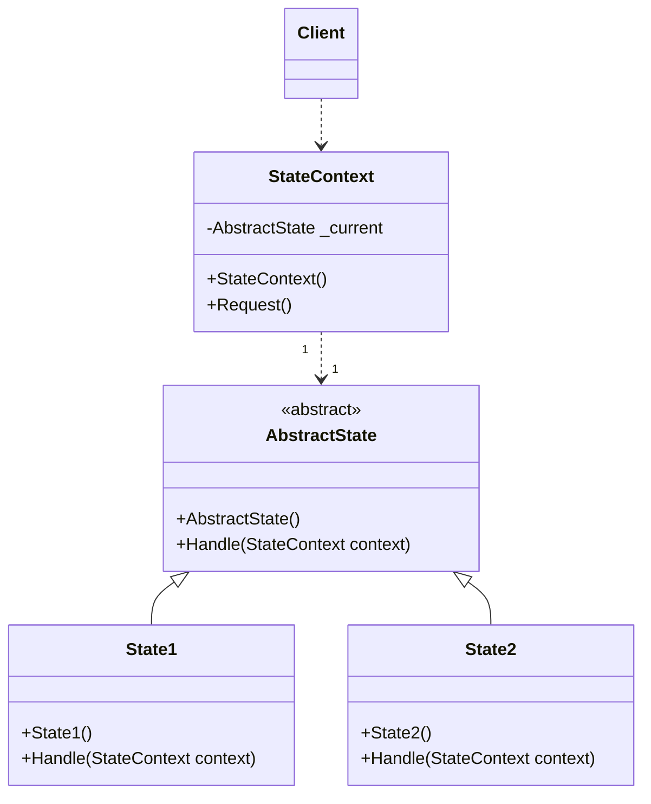
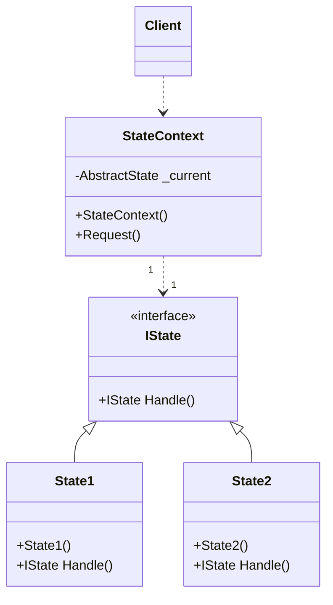

# Design Pattern - State

## todo 農夫渡河

+ 當一個物件(StateContext)的內在狀態(State)改變時允許改變其行為，這個物件看起來就像是改變了其類別。
+ 讓物件自己決定狀態的轉變，藉以消弭複雜的判斷邏輯。
+ 以農夫渡河為例，農夫在左邊，就一定是從左邊移到右邊，且農夫之後在右邊；農夫在右邊，就一定是從右邊移到左邊，且農夫之後在左邊
+ 若狀態切換得很頻繁，程式會一直在 new 新的狀態類別，可能有一直在重整 heap 空間的效能問題，可用其它方法避免

## 類別圖


+ StateContext
  + 制訂讓 Client 端呼叫的介面。
  + 以 AbstractState 型別持有一個具體的State 執行個體(如圖中的State1 或State2)，代表目前的狀態。
+ AbstractState
  + 負責封裝 Context 處於特定狀態時的行為。可以是 interface 或是 abstract class
+ ConcreteState
  + AbstractState 的實作，具體實作出特定狀態的行為內容。

<br/>AbstractState 抽象類別，本身沒有儲存狀態，因為型別本身就是狀態
```csharp
public abstract class AbstractState
{
    public abstract void Handle(StateContext context);
}
```

<br/>子類別 State1，須實作出特定狀態的具體行為內容
```csharp
public class State1 : AbstractState
{
    public override void Handle(StateContext context)
    {
        Console.WriteLine("1");
        context.Current = new State2();
    }
}
```

<br/>子類別 State2，須實作出特定狀態的具體行為內容
```csharp
public class State2 : AbstractState
{
    public override void Handle(StateContext context)
    {
        Console.WriteLine("2");
        context.Current = new State1();
    }
}
```

<br/>StateContext 類別，實際持有狀態，且 Client 端只接髑這個類別
```csharp
public class StateContext
{
    // 實際持有狀態
    internal AbstractState Current { get; set; }

    public StateContext()
    {
        Current = new State1();
    }

    public void Request()
    {
        if (Current != null)
        {
            Current.Handle(this);
        }
    }
}
```

<br/>Client 端程式，只須認識 StateContext, 不須認識 State 的父類別與實作
```csharp
StateContext context = new StateContext();
for (int i = 0; i < 10; i++)
{
    context.Request();
}
```

## 變形 – 將狀態以回傳方式傳給 Context

### 類別圖


<br/>IState 介面，將下一個 State 物件傳回
```csharp
public interface IState
{
    IState Handle();
}
```

<br/>子類別 State1
```csharp
public class State1 : IState
{
    public IState Handle()
    {
        Console.WriteLine("5");
        return new State2();
    }
}
```

<br/>子類別 State2
```csharp
public class State2 : IState
{
    public IState Handle()
    {
        Console.WriteLine("6");
        return new State1();
    }
}
```

<br/>StateContext 類別，沒什麼變化
```csharp
public class StateContext
{
    private IState Current { get; set; }

    public StateContext()
    {
        Current = new State1();
    }

    public void Request()
    {
        if (Current != null)
        {
            Current = Current.Handle();
        }
    }
}
```

<br/>Client 端程式
```csharp
StateContext context = new StateContext();

for (int i = 0; i < 10; i++)
{
    context.Request();
}
```

## 變形 – 結合 Registry of Singleton
降低前例中的狀態物件生成

<br/>AbstractState 抽象類別
```csharp
public abstract class AbstractState
{
    public abstract void Handle(StateContext context);
}
```

<br/>子類別 State1
```csharp
public class State1 : AbstractState
{
    public override void Handle(StateContext context)
    {
        Console.WriteLine("8");
        context.Current = context.GetInstance<State2>(); 
    }
}
```

<br/>子類別 State2
```csharp
public class State2 : AbstractState
{
    public override void Handle(StateContext context)
    {
        Console.WriteLine("9");
        context.Current = context.GetInstance<State1>();
    }
}
```

<br/>StateContext 類別，結合 Registry of Singleton
```csharp
public class StateContext
{
    private readonly Dictionary<string, AbstractState> _registry = new Dictionary<string, AbstractState>();

    public AbstractState Current { get; set; }

    public StateContext()
    {
        Current = GetInstance<State1>();
    }

    public AbstractState GetInstance<T>() where T : AbstractState, new()
    {
        Type type = typeof(T);
        string key = type.Name;
        if (!_registry.ContainsKey(key))
        {
            _registry[key] = new T();
        }
        return (T)_registry[key];
    }

    public void Request()
    {
        if (Current != null)
        {
            Current.Handle(this);
        }
    }
}
```

<br/>Client 端程式
```csharp
StateContext context = new StateContext();

for (int i = 0; i < 10; i++)
{
    context.Request();
}
```