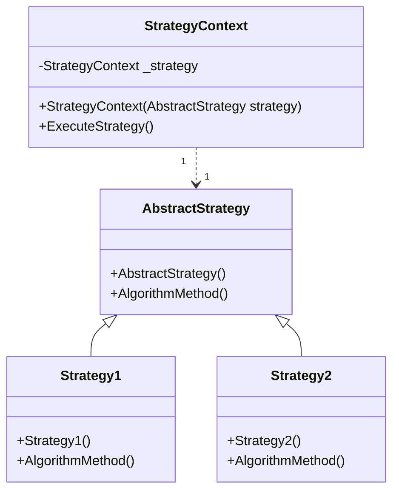

# Design Pattern - Strategy

```mermaid
classDiagram
class StrategyContext {
    -StrategyContext _strategy
    +StrategyContext(AbstractStrategy strategy)
    +ExecuteStrategy()
}

class AbstractStrategy {
    +AbstractStrategy()
    +AlgorithmMethod()
}

class Strategy1 {
    +Strategy1()
    +AlgorithmMethod()
}

class Strategy2 {
    +Strategy2()
    +AlgorithmMethod()
}

StrategyContext "1" ..> "1" AbstractStrategy
AbstractStrategy <|-- Strategy1
AbstractStrategy <|-- Strategy2
```