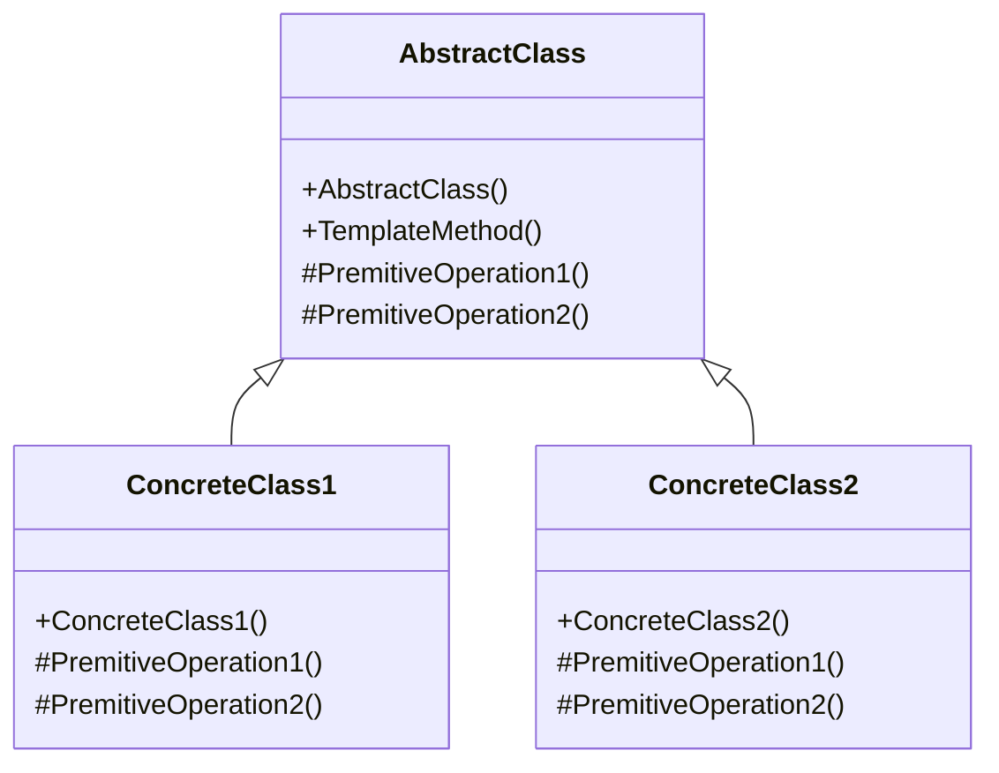

# Design Pattern - Template

```mermaid
classDiagram
class AbstractClass {
    +AbstractClass()
    +TemplateMethod()
    #PremitiveOperation1()
    #PremitiveOperation2()
}

class ConcreteClass1 {
    +ConcreteClass1()
    #PremitiveOperation1()
    #PremitiveOperation2()
}

class ConcreteClass2 {
    +ConcreteClass2()
    #PremitiveOperation1()
    #PremitiveOperation2()
}

AbstractClass <|-- ConcreteClass1
AbstractClass <|-- ConcreteClass2
```