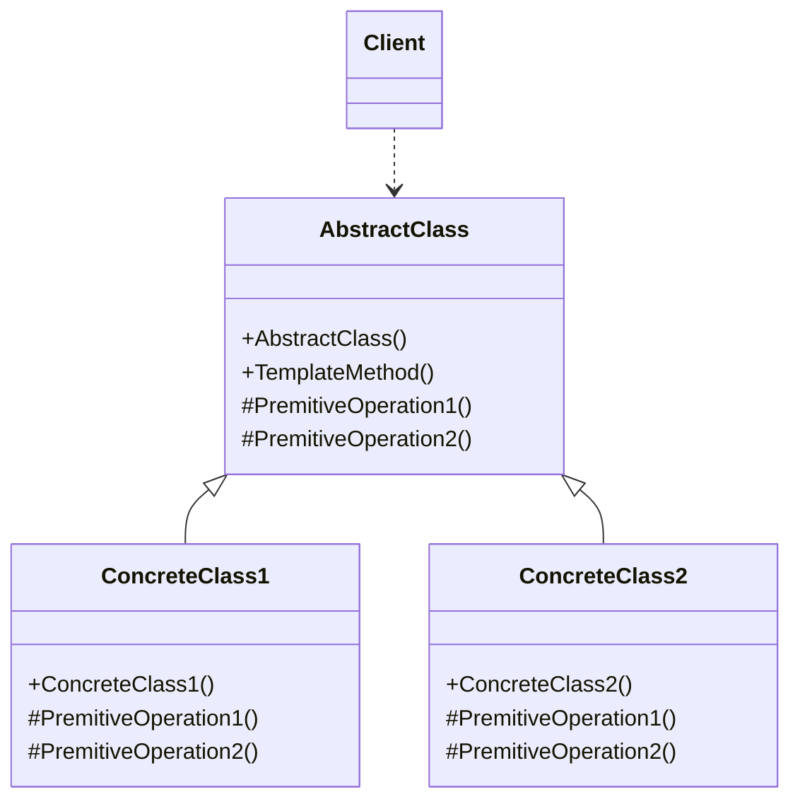

# Design Pattern - Template

- [Design Pattern - Template](#design-pattern---template)
  - [概觀](#概觀)
  - [+ 把通用實做放在基底類別](#-把通用實做放在基底類別)
  - [類別圖](#類別圖)
      - [pseudo code](#pseudo-code)
  - [委派與範本模式](#委派與範本模式)
    - [使用委派模擬 Enumerable.Where](#使用委派模擬-enumerablewhere)
    - [使用 Template 委派模擬 Enumerable.Where](#使用-template-委派模擬-enumerablewhere)
---
## 概觀
+ 在一個操作中定義一個演算法框架，而將依些步驟(實作細節)遞延到子類別，使得子類別不需要改變演算法的步驟即可重新定義該演算法的某些特定步驟。
+ 減少多餘的程式碼
+ 把通用實做放在基底類別
---
## 類別圖


+ AbstractClass
  + 將完整演算法中某些會變化的基礎步驟定義為 Primitive Operation ，通常為抽象(abstract)成員，也有可能是虛擬(virtual)成員，這些Primitive Operation 的細節會交由衍生類別來實作
  + 具體實作Template Method，定義出演算法的輪廓，在此會呼叫Primitive Operation 以及其他物件所提供的必要操作來完成整個程序。
  + 以抽象類別(abstract class)的形式呈現
+ ConcreteClass
  + 衍生自AbstractClass 的具體類別，具體實作必要的 Primitive Operation。

<br/>

#### pseudo code
如下圖，父類別只規定 PremitiveOperation1 必須先做完，才能去做 PremitiveOperation2，但是不定義這兩個函式的實作，由子類別去定義。
```csharp
public abstract class AbstractClass
{
    public void TemplateMethod()
    {
        PremitiveOperation1();
        PremitiveOperation2();
    }

    protected abstract void PremitiveOperation1();
    protected abstract void PremitiveOperation2();
}
```

<br/>子類別 1
```csharp
public abstract class ConcreateClass1 : AbstractClass
{
    protected override void PremitiveOperation1()
    {}

    protected override void PremitiveOperation2()
    {}
}
```

<br/>子類別 2
```csharp
public abstract class ConcreateClass2 : AbstractClass
{
    protected override void PremitiveOperation1()
    {}

    protected override void PremitiveOperation2()
    {}
}
```

<br/>Client 端程式碼
```csharp
AbstractClass template = new ConcreateClass2();
template.TemplateMethod();
```
---
## 委派與範本模式
+ 委派和範本模式有互換的空間
+ 適合使用委派替代的情境：
  + 與其他執行個體成員的內聚性較低的時候。
  + Primitive Operation 的數量較少，但內容變化很大的情境。
  + 需要處理泛型的情境

<br/>

### 使用委派模擬 Enumerable.Where
建立 Extension Method，並傳入委派，模擬 Enumerable Class 的 Where Method
```csharp
public static class CustomClass
{
    public static IEnumerable<T> DoWhere<T>(this IEnumerable<T> source, Func<T, bool> predicate)
    {
        foreach (T item in source)
        {
            if (predicate.Invoke(item))
            {
                yield return item;
            }
        }
    }
}
```

<br/>Client 端程式碼
```csharp
List<int> list = new List<int>();
for(int i = 0; i < 10; i++)
{
    list.Add(i);
}

var result = list.DoWhere((x) => x > 4);
foreach (var item in result)
{
    Console.WriteLine(item);
}
```

<br/>

### 使用 Template 委派模擬 Enumerable.Where
使用 Template Method 模式來模擬 Where Method 的功能
<br/>父類別
```csharp
public abstract  class CustomClass<T>
{
    private IEnumerable<T> _source;

    public CustomClass(IEnumerable<T> source)
    {
        _source = source;
    }

    public IEnumerable<T> DoWhere()
    {
        foreach (var item in _source)
        {
            if (Predicate(item))
            {
                yield return item;
            }
        }
    }

    protected abstract bool Predicate(T item);
}
```

<br/>子類別，覆寫 Predicate 方法
```csharp
public class PredicateInt : CustomClass<int>
{
    public PredicateInt(IEnumerable<int> source) : base(source)
    { }

    protected override bool Predicate(int item)
    {
        return item > 3;
    }
}
```

<br/>Client 端程式碼
```csharp
List<int> list = new List<int>();
for (int i = 0; i < 10; i++)
{
    list.Add(i);
}

PredicateInt o = new PredicateInt(list);
var result = o.DoWhere();

foreach (var item in result)
{
    Console.WriteLine(item);
}
```