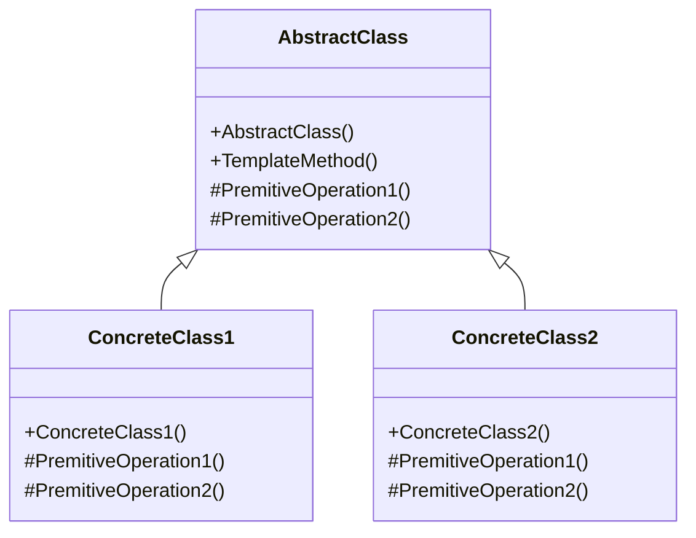

# Design Pattern - Template

+ 在一個操作中定義一個演算法框架，而將依些步驟(實作細節)遞延到子類別，使得子類別不需要改變演算法的步驟即可重新定義該演算法的某些特定步驟。
+ 減少多餘的程式碼
+ 把通用實做放在基底類別



+ AbstractClass
  + 將完整演算法中某些會變化的基礎步驟定義為 Primitive Operation ，通常為抽象(abstract)成員，也有可能是虛擬(virtual)成員，這些Primitive Operation 的細節會交由衍生類別來實作
  + 具體實作Template Method，定義出演算法的輪廓，在此會呼叫Primitive Operation 以及其他物件所提供的必要操作來完成整個程序。
  + 以抽象類別(abstract class)的形式呈現
+ ConcreteClass
  + 衍生自AbstractClass 的具體類別，具體實作必要的 Primitive Operation。

<br/>如下圖，父類別只規定 PremitiveOperation1 必須先做完，才能去做 PremitiveOperation2，但是不定義這兩個函式的實作，由子類別去定義
```csharp
// 一般化的抽象類別
public abstract class AbstractClass
{
    public void TemplateMethod()
    {
        PremitiveOperation1();
        PremitiveOperation2();
    }

    protected abstract void PremitiveOperation1();
    protected abstract void PremitiveOperation2();
}
```

```csharp
public abstract class AbstractClass
{
    public void TemplateMethod()
    {
        PremitiveOperation1();
        PremitiveOperation2();
    }

    protected abstract void PremitiveOperation1();
    protected abstract void PremitiveOperation2();
}
```

```csharp
public abstract class ConcreateClass1 : AbstractClass
{
    protected override void PremitiveOperation1()
    {}

    protected override void PremitiveOperation2()
    {}
}
```

```csharp
public abstract class ConcreateClass2 : AbstractClass
{
    protected override void PremitiveOperation1()
    {}

    protected override void PremitiveOperation2()
    {}
}
```