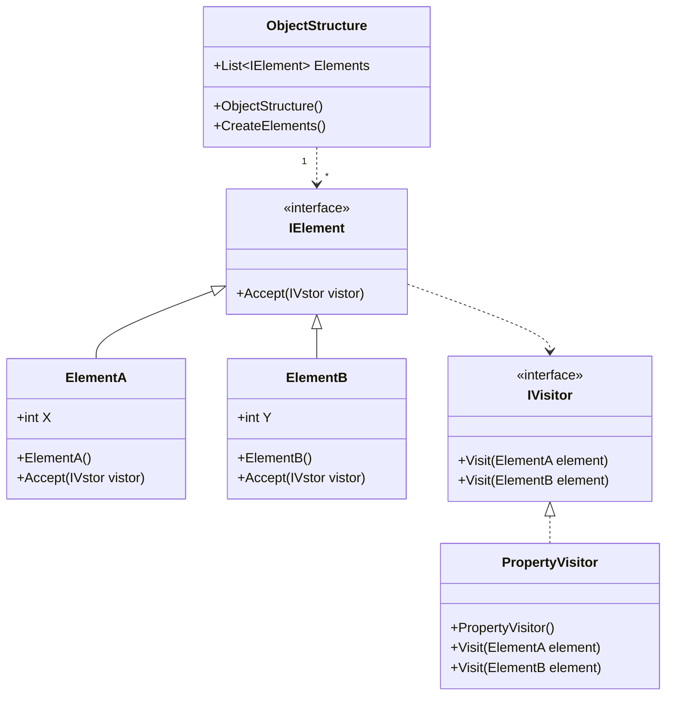

# Design Pattern - Vistor

```mermaid
classDiagram
class ObjectStructure {
    +List~IElement~ Elements
    +ObjectStructure()
    +CreateElements()
}

class IElement {
    <<interface>>
    +Accept(IVstor vistor)
}

class ElementA {
    +int X
    +ElementA()
    +Accept(IVstor vistor)
}

class ElementB {
    +int Y
    +ElementB()
    +Accept(IVstor vistor)
}

class IVisitor {
    <<interface>>
    +Visit(ElementA element)
    +Visit(ElementB element)
}

class PropertyVisitor {
    +PropertyVisitor()
    +Visit(ElementA element)
    +Visit(ElementB element)
}

ObjectStructure "1" ..> "*" IElement

IElement ..> IVisitor
IElement <|-- ElementA
IElement <|-- ElementB

IVisitor <|.. PropertyVisitor
```