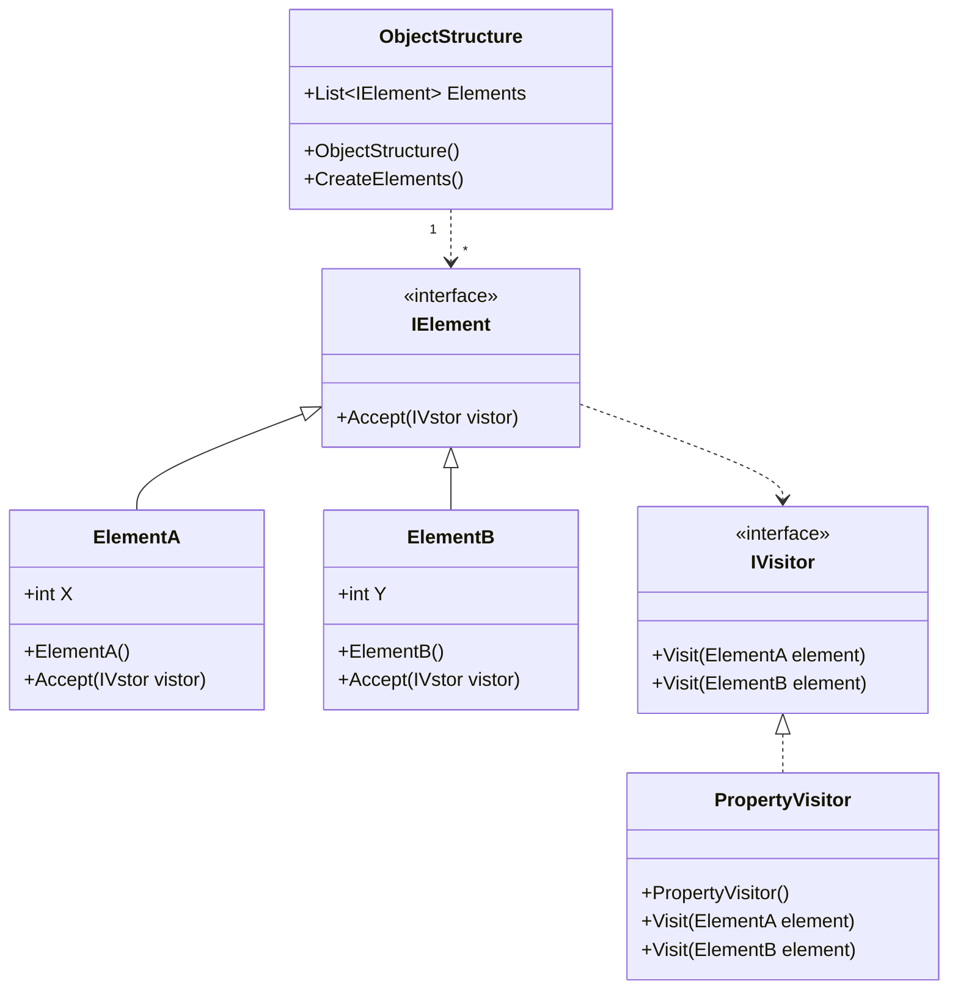

# Design Pattern - Vistor

- [Design Pattern - Vistor](#design-pattern---vistor)
  - [概觀](#概觀)
  - [類別圖](#類別圖)
    - [pseudo code](#pseudo-code)

---
## 概觀
+ 定義一個能夠作用某個資料結構中各個元素的操作，在不需要修改原有資料結構的狀況下去拓展適用於這些元素的操作。
+ 讓複雜物件結構的操作能夠易於拓展。
+ 分離資料結構與其操作。→如果你的需求只有這個，用 extension method 較簡單

---
## 類別圖


<br/>

### pseudo code
IElement 介面
```csharp
public interface IElement
{
    void Accept(IVisitor visitor);
}
```

<br/>Element 子類別
```csharp
public class ElementA : IElement
{
    public int X { get; set; }
    
    public void Accept(IVisitor visitor)
    {
        visitor.Visit(this);
    }
}

public class ElementB : IElement
{
    public int Y { get; set; }

    public void Accept(IVisitor visitor)
    {
        visitor.Visit(this);
    }
}
```

<br/>IVistor 介面
```csharp
public interface IVisitor
{
    void Visit(ElementA element);
    void Visit(ElementB element);
}
```

<br/>PropertyVisitor 類別
```csharp
public class PropertyVisitor : IVisitor
{
    public void Visit(ElementA element)
    {
        Console.WriteLine(element.X);
    }

    public void Visit(ElementB element)
    {
        Console.WriteLine(element.Y);
    }
}
```

<br/>ObjectStructure 類別
```csharp
public class ObjectStructure
{
    public List<IElement> Elements { get; set; }

    public ObjectStructure()
    {
        CreateElements();
    }

    private void CreateElements()
    {
        Elements = new List<IElement>();
        for (int i = 0; i < 5; i++)
        {
            Elements.Add(new ElementA() { X = i });
            Elements.Add(new ElementB() { Y = i + 10 });
        }
    }
}
```

<br/>Client 端程式
```csharp
PropertyVisitor visitor = new PropertyVisitor();
ObjectStructure o = new ObjectStructure();

foreach (var item in o.Elements)
{
    item.Accept(visitor);
}
```

<br/>講師說他自己也只用過一次，他的心得是很難寫，建議我們照著範例寫一次，就可知道在寫的過程 compiler 會一直出現毛毛蟲