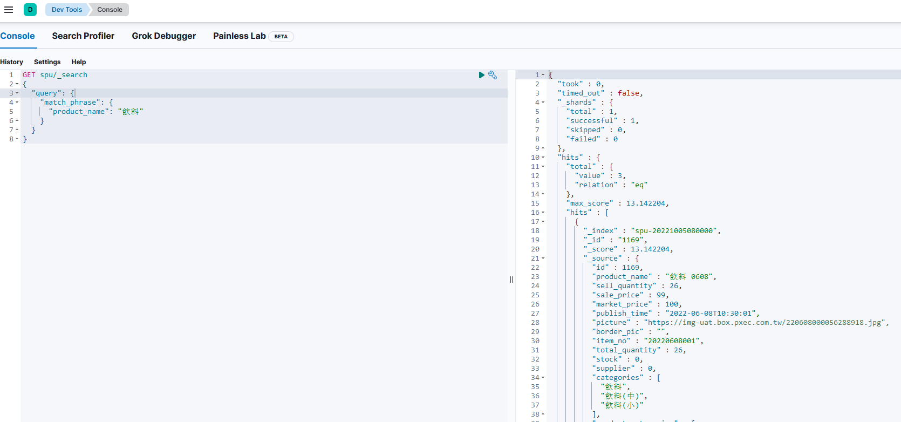

# 套用 IK 分詞器與否的差別

使用工具:
- Kibana 8.2.3
- Elasticsearch 8.2.3, 也須安裝套件 IK 分詞器

在 Kibana 的 Dev Tools 試驗以下操作


## 不套用 IK 分詞器
輸入
```
GET _analyze
{
  "text": "永豐餘柔情特柔連續抽取式衛生"
}
```

輸出結果，被拆成每個字：永、豐、餘、柔、情、特、柔、連、續、抽、取、式、衛、生
```
{
  "tokens" : [
    {
      "token" : "永",
      "start_offset" : 0,
      "end_offset" : 1,
      "type" : "<IDEOGRAPHIC>",
      "position" : 0
    },
    {
      "token" : "豐",
      "start_offset" : 1,
      "end_offset" : 2,
      "type" : "<IDEOGRAPHIC>",
      "position" : 1
    },
    {
      "token" : "餘",
      "start_offset" : 2,
      "end_offset" : 3,
      "type" : "<IDEOGRAPHIC>",
      "position" : 2
    },
    {
      "token" : "柔",
      "start_offset" : 3,
      "end_offset" : 4,
      "type" : "<IDEOGRAPHIC>",
      "position" : 3
    },
    {
      "token" : "情",
      "start_offset" : 4,
      "end_offset" : 5,
      "type" : "<IDEOGRAPHIC>",
      "position" : 4
    },
    {
      "token" : "特",
      "start_offset" : 5,
      "end_offset" : 6,
      "type" : "<IDEOGRAPHIC>",
      "position" : 5
    },
    {
      "token" : "柔",
      "start_offset" : 6,
      "end_offset" : 7,
      "type" : "<IDEOGRAPHIC>",
      "position" : 6
    },
    {
      "token" : "連",
      "start_offset" : 7,
      "end_offset" : 8,
      "type" : "<IDEOGRAPHIC>",
      "position" : 7
    },
    {
      "token" : "續",
      "start_offset" : 8,
      "end_offset" : 9,
      "type" : "<IDEOGRAPHIC>",
      "position" : 8
    },
    {
      "token" : "抽",
      "start_offset" : 9,
      "end_offset" : 10,
      "type" : "<IDEOGRAPHIC>",
      "position" : 9
    },
    {
      "token" : "取",
      "start_offset" : 10,
      "end_offset" : 11,
      "type" : "<IDEOGRAPHIC>",
      "position" : 10
    },
    {
      "token" : "式",
      "start_offset" : 11,
      "end_offset" : 12,
      "type" : "<IDEOGRAPHIC>",
      "position" : 11
    },
    {
      "token" : "衛",
      "start_offset" : 12,
      "end_offset" : 13,
      "type" : "<IDEOGRAPHIC>",
      "position" : 12
    },
    {
      "token" : "生",
      "start_offset" : 13,
      "end_offset" : 14,
      "type" : "<IDEOGRAPHIC>",
      "position" : 13
    }
  ]
}
```

建立 mapping
```
PUT test_no_ik
{
  "mapping": {
    "properties": {
      "message": {
        "type": "text"
      }
    }
  }
}
```

塞入 document「永豐餘柔情特柔連續抽取式衛生」
```
POST test_no_ik/_doc
{
  "message": "永豐餘柔情特柔連續抽取式衛生"
}
```

再用 term query 去尋找「衛生」，是查不到作何結果
```
GET roody-test-no_ik/_search
{
  "query": {
    "term": {
      "message": "衛生"
    }
  }
}
```
因為如上面的動作，是被拆成「永、豐、餘、柔、情、特、柔、連、續、抽、取、式、衛、生」去做倒排索引，所以拿整串字去找是找不到結果的


如果我們用 match phrase query 去尋找「衛生」，是可以查結果，分數 0.5753642

## 套用 IK 分詞器

輸入
```
GET _analyze
{
  "analyzer": "ik_max_word",
  "text": "永豐餘柔情特柔連續抽取式衛生"
}
```

輸出結果，被拆成每個字

永豐餘、永豐、豐餘、柔情、特柔、連續、抽取式、抽取、式、衛生
```
{
  "tokens" : [
    {
      "token" : "永豐餘",
      "start_offset" : 0,
      "end_offset" : 3,
      "type" : "CN_WORD",
      "position" : 0
    },
    {
      "token" : "永豐",
      "start_offset" : 0,
      "end_offset" : 2,
      "type" : "CN_WORD",
      "position" : 1
    },
    {
      "token" : "豐餘",
      "start_offset" : 1,
      "end_offset" : 3,
      "type" : "CN_WORD",
      "position" : 2
    },
    {
      "token" : "柔情",
      "start_offset" : 3,
      "end_offset" : 5,
      "type" : "CN_WORD",
      "position" : 3
    },
    {
      "token" : "特柔",
      "start_offset" : 5,
      "end_offset" : 7,
      "type" : "CN_WORD",
      "position" : 4
    },
    {
      "token" : "連續",
      "start_offset" : 7,
      "end_offset" : 9,
      "type" : "CN_WORD",
      "position" : 5
    },
    {
      "token" : "抽取式",
      "start_offset" : 9,
      "end_offset" : 12,
      "type" : "CN_WORD",
      "position" : 6
    },
    {
      "token" : "抽取",
      "start_offset" : 9,
      "end_offset" : 11,
      "type" : "CN_WORD",
      "position" : 7
    },
    {
      "token" : "式",
      "start_offset" : 11,
      "end_offset" : 12,
      "type" : "CN_CHAR",
      "position" : 8
    },
    {
      "token" : "衛生",
      "start_offset" : 12,
      "end_offset" : 14,
      "type" : "CN_WORD",
      "position" : 9
    }
  ]
}

```

建立 mapping
```
PUT test_with_ik
{
  "mapping": {
    "properties": {
      "message": {
        "type": "text",
        "analyzer": "ik_max_word"
      }
    }
  }
}
```

塞入 document「永豐餘柔情特柔連續抽取式衛生」
```
POST test_with_ik/_doc
{
  "message": "永豐餘柔情特柔連續抽取式衛生"
}
```

再用 term query 去尋找「衛生」，就可以查到結果，分數 0.2876821
```
GET test_with_ik/_search
{
  "query": {
    "term": {
      "message": "衛生"
    }
  }
}
```

如果我們再用 match phrase query 去尋找「衛生」，也可以查到結果，分數 0.2876821
```
GET test_with_ik/_search
{
  "query": {
    "match_phrase": {
      "message": "衛生"
    }
  }
}
```

套用 IK 分詞器會讓 term query 也可以查出東西，比較好奇的是，用 term query 和 match phrase query 的兩者分數會一樣，看不出差別，也許在中文還須套用同義詞

