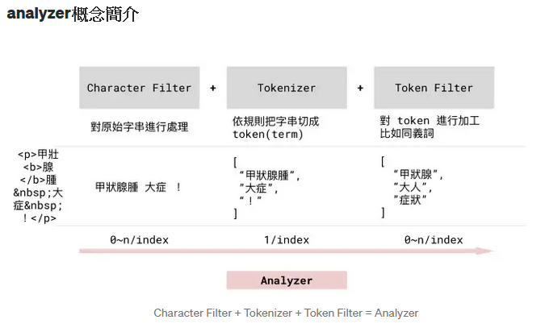

# Elasticsearch 中文分詞、同義詞

- [ ] 將連結的內容寫成自己的筆記

Elasticsearch 的 analyzer，都由三個 module 組成：character filter、tokenizer、token filter

## character filter
增加、刪除或修改字元

例如把阿拉伯数字（٠‎١٢٣٤٥٦٧٨‎٩）‎ 轉成 Arabic-Latin 的等價物（0123456789）。

一個 analyzer 可能有 0 個或多個 charcter filter，它們按順序使用。

## tokenizer

將字串分成數個 token，例如，「純喫茶」要被拆成「純」、「喫」、「茶」、「純喫茶」

一個 analyzer 只能有 1 個 tokenizer

## token filter

增加、刪除或修改 token

例如將 token 轉成小寫、增加同義的 token

一個 analyzer 可能有 0 個或多個 tokenizer，它們按順序使用。

<br/>如下圖

---

<br/>指定特定 index 的特定 document 的特定欄位，確認會被拆成什麼詞，
```json
GET {index_name}}/_termvectors/{id}}
{
  "fields": ["{your_column_name}", "{your_column_name2}"],
  "offsets" : false,
  "payloads" : false,
  "positions" : false,
  "term_statistics" : true,
  "field_statistics" : true
}

```

---

## IK 分詞器
- [[教學] Elasticsearch 安裝與支援繁體中文分詞](https://xenby.com/b/325-%E6%95%99%E5%AD%B8-elasticsearch-%E5%AE%89%E8%A3%9D%E8%88%87%E6%94%AF%E6%8F%B4%E7%B9%81%E9%AB%94%E4%B8%AD%E6%96%87%E5%88%86%E8%A9%9E)
- [ElasticSearch7.3學習(十五)----中文分詞器(IK Analyzer)及自定義詞庫](https://iter01.com/674996.html)
- [Elasticsearch 預設分詞器和中分分詞器之間的比較及使用方法](https://codertw.com/%E7%A8%8B%E5%BC%8F%E8%AA%9E%E8%A8%80/14418/#outline__2_1_1_1)
- [ElasticSearch中文分词，看这一篇就够了](https://blog.csdn.net/qq_26803795/article/details/106522611)

---

## 同義詞
- [Elasticsearch 中文同義詞與自動完成](https://medium.com/cw-itgroup/elasticsearch-%E4%B8%AD%E6%96%87%E5%90%8C%E7%BE%A9%E8%A9%9E%E8%88%87%E8%87%AA%E5%8B%95%E5%AE%8C%E6%88%90-693410e68b0a)
- [Elasticsearch學習筆記6: 同義詞搜尋實現](https://codertw.com/%E4%BC%BA%E6%9C%8D%E5%99%A8/159482/)

