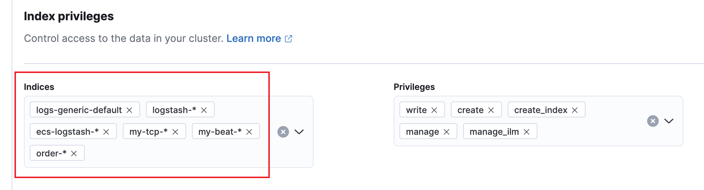

# elk 安裝筆記

- [ ] 看 serilog, nlog 寫  docker log 的差別
  - 在 AWS 開兩台機器架，分別架  elk 和程式，將程式的 log 送到 elk

---

直接將檔案經由 tcp 餵給 logstash
```shell
nc 127.0.0.1 5000 < hello.txt
ncat 127.0.0.1 5000 < hello.txt
```

---

如何對寫出的 grok expression 除錯
- grok debugger，線上 debug 工具
- Kibana 在 Dev Tools 提供的 grok debugger

---

<br/>查 elasticsearch index
```shell
curl -XGET http://127.0.0.1:9200/_cat/indices?v
curl -H "Authorization: ApiKey {your_apikey}" -XGET http://127.0.0.1:9200/_cat/indices?v
```

<br/>線程狀態
```shell
curl -s -XGET http://127.0.0.1:9200/_cat/thread_pool?v
```

<br/>叢集狀態
```shell
curl -XGET http://127.0.0.1:9200/_cat/health?v
```

<br/>節點狀態
```shell
curl -XGET http://127.0.0.1:9200/_cat/nodes?v
```

<br/>可以透過參數 ?help 來幫助我們了解各個回傳結果欄位所代表的意義
```shell
curl -s -XGET http://127.0.0.1:9200/_cat/thread_pool?help
```

<br/>建立 log 資料
```http
POST http://127.0.0.1:9200/my-diablo-2022/_doc HTTP/1.1 
Content-Type: application/json 
{ 
  "userNme" : "weiwei", 
  "@timestamp" : "2022-07-33T02:50:29.070Z", 
  "message" : "This is a meaage for testing POST 3" 
}
```
---

Logstash 用 logstash_internal 將資料寫入 Elasticsearch，而 logstash_internal 的 Role 是 logstash_writer。

如果把 elasticsearch 的檢查權限開關給打開了，如果有需要，可讓 logstash_writer 這角色有建立 Index 的權限

可以在 Kibana 設定，給予它能建立 Index 的權限。

